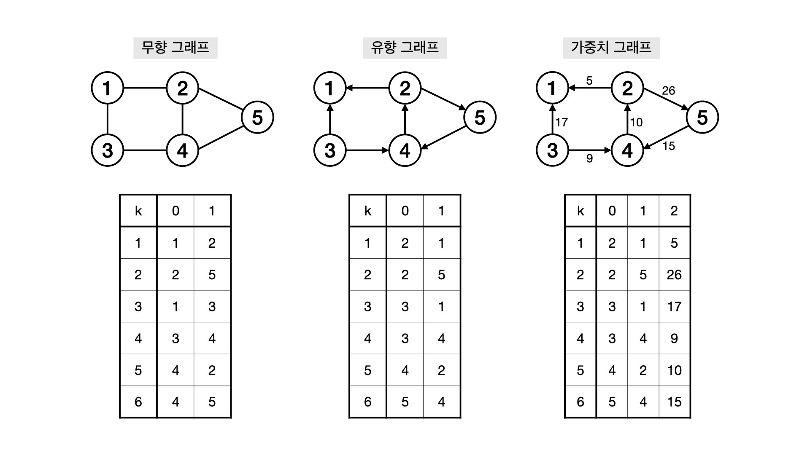
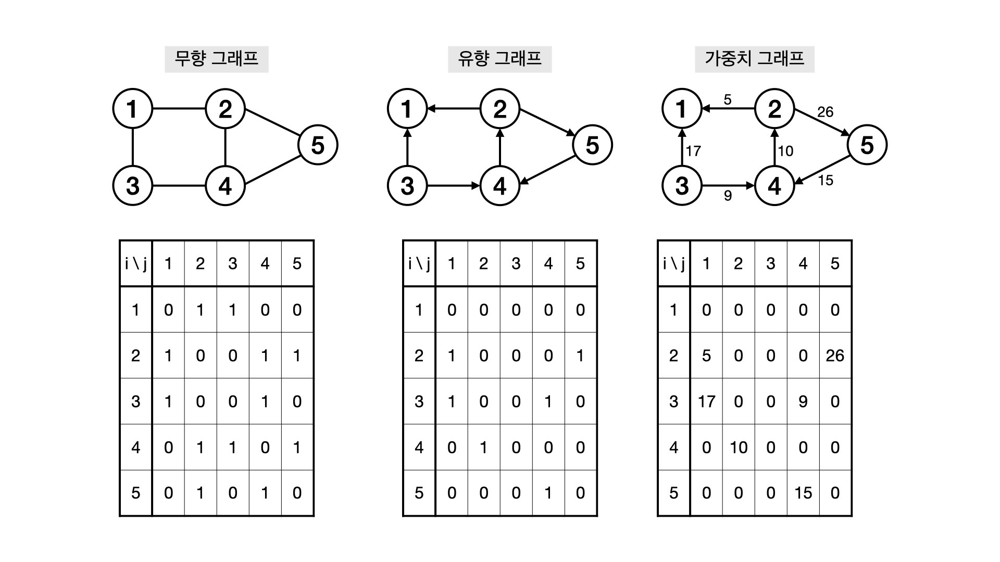
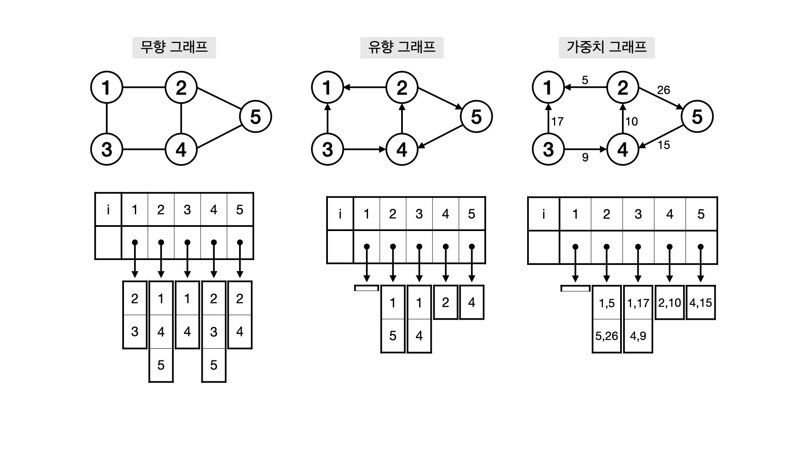

# 기본 자료 구조
 
> 작성자 : [서그림](https://github.com/Seogeurim)

자료구조(Data Structure)란 **자료에 효율적으로 접근하고 수정할 수 있도록 데이터를 구성하고 저장하는 방법**을 이야기한다. 
자료구조는 저장되는 데이터의 형태에 따라 **선형 자료구조**와 **비선형 자료구조**로 구분되며, 
선형 자료구조는 데이터가 일렬로 나열되어 있고 비선형 자료구조는 데이터가 특정한 형태를 띄고 있다. 
선형 자료구조의 종류에는 array, linked list, stack, queue 등이 있으며 비선형 자료구조로는 tree, graph 등이 있다.

<details>
<summary>Table of Contents</summary>

- [Array (배열)](#array-배열)
- [Linked List (연결 리스트)](#linked-list-연결-리스트)
- [Stack (스택)](#stack-스택)
- [Queue (큐)](#queue-큐)
- [Tree (트리)](#tree-트리)
- [Binary Tree (이진 트리)](#binary-tree-이진-트리)
- [Graph (그래프)](#graph-그래프)

</details>

---

## Array (배열)

동일한 자료형의 데이터를 일렬로 나열한 자료구조이다.

- 선형 자료구조
- 데이터 접근이 용이하다. (인덱스로 접근 - Random Access가 가능)
- 데이터 삽입/삭제가 어렵다. (Shift 해줘야 함)
- 구조가 간단하여 프로그램 작성이 쉽다.

### Array 구현

#### Java

```java
/* 선언 (Declaring Arrays) */
int[] arrayOfInt;
String[] arrayOfString;

/* 생성 (Creating Arrays) */
arrayOfInt = new int[100];
arrayOfString = new String[10];

/* 초기화 (Initializing Arrays) */
for (int i = 0; i < arrayOfInt.length; i++) {
  arrayOfInt[i] = i;
}
arrayOfString = new String[]{"hello", "world"};
String[] name = {"Stacy", "Tracy", "Dorothy"};
```

### Array 시간 복잡도 & 공간 복잡도

#### 시간 복잡도

- 데이터 조회 : O(1)
- 데이터 삽입/삭제하기 : O(n)

---

## Linked List (연결 리스트)

각 노드가 **데이터**와 **포인터**를 가지고 일렬로 연결되어 있는 방식이다.

- 선형 자료구조
- 데이터의 접근이 느리다. (링크를 타고 가서 찾아야 한다.)
- 데이터의 삽입/삭제 연산이 용이하다.
- 포인터를 위한 추가 공간이 필요하다.

### Linked List 구현

- [Singly Linked List](./code/LinkedList/SinglyLinkedList.java)
- [Doubly Linked List](./code/LinkedList/DoublyLinkedList.java)
- 위 코드 실행 : [LinkedListExample.java](./code/LinkedList/LinkedListExample.java)

### Linked List 시간 복잡도

- 데이터 조회 : O(n)
- **맨 앞/뒤에** 데이터 삽입/삭제하기 : O(1) (SinglyLinkedList의 경우 맨 뒤의 데이터 삭제 연산은 O(n))
- **중간의 원하는 위치에** 데이터 삽입/삭제하기 : O(n) _(원하는 원소까지 데이터를 조회하는 과정이 있으므로 O(n) + O(1))_

> #### Array와 Linked List의 차이
> - 데이터 접근 속도
>   - Array는 인덱스를 통한 Random Access를 지원하므로 시간 복잡도 O(1)로 빠르게 찾을 수 있다.
>   - LinkedList는 순차 접근 방식을 사용하므로 시간 복잡도 O(N)이 걸린다.
> - 데이터의 삽입/삭제 속도
>   - Array는 데이터를 중간이나 맨 앞에 삽입/삭제하는 경우 shift가 필요하므로 데이터가 많을수록 비효율적이다.
>   - LinkedList는 중간 삽입/삭제는 똑같이 O(N)의 시간 복잡도를 갖지만, 맨 앞 또는 뒤에 삽입할 경우 O(1)의 시간복잡도를 갖는다.
>   - 다만 LinkedList는 데이터 삽입/삭제마다 메모리 할당/해제가 일어나므로 시간복잡도는 빠를지라도 시스템 콜(System Call)에 있어서 Array보다 더 시간이 걸린다.
> - 메모리 할당
>   - Array는 정적 메모리 할당이 이루어진다. (Compile time)
>   - LinkedList는 동적 메모리 할당이 이루어진다. (Runtime)
>   - Array의 경우 데이터 삽입 시 모든 공간이 다 차버렸다면 새로운 메모리 공간이 필요하지만 LinkedList는 동적으로 할당받을 수 있다.
>
> 데이터 삽입/삭제가 빈번하다면 LinkedList를 사용하는 것이 좋고, 데이터 접근 속도가 중요하다면 Array를 사용하는 것이 좋다.


---

## Stack (스택)

- 선형 자료구조
- 삽입, 삭제 연산이 한 방향에서 이루어진다.
- **LIFO(Last In First Out)** : 나중에 들어간 원소가 먼저 나오는 구조이다.

### Stack 용어

- `Top` : 스택에 데이터가 삽입될 위치

### Stack 주요 연산

- `push` : 스택의 top에 원소 삽입
- `pop` : 스택의 top에 있는 원소 삭제 및 반환
- `peek` : 스택의 top에 있는 원소 반환

### Stack 구현

- [Array를 통해 구현한 Stack](./code/Stack/ArrayStack.java)
- [Singly Linked List를 통해 구현한 Stack](./code/Stack/LinkedStack.java)
- 위 코드 실행 : [StackExample.java](./code/Stack/StackExample.java)

### Stack 시간 복잡도 & 공간 복잡도

- 데이터 삽입/삭제 : O(1)
- top 데이터 조회 : O(1)
- 특정 데이터 조회 : O(n)

### Stack 활용

- 시스템 스택(System Stack) / 실행시간 스택(Runtime stack) : 프로그램의 함수 호출과 복귀에 따른 실행 순서 관리
- 인터럽트 루틴 처리
- 웹 브라우저 방문 기록 관리 (뒤로가기)
- 실행 취소 (undo)
- 수식의 후위 표기법(Postfix Notation)
- 수식의 괄호식 검사
- 계산기 검사
- 깊이 우선 탐색(DFS, Depth-First Search)

> **프로그램의 함수 호출과 복귀에 따른 실행 순서 관리는 다음과 같은 과정을 가진다.**
> 
> 1. 함수 호출이 발생하면 스택 프레임(stack frame)에 지역변수, 매개변수, 수행 후 복귀할 주소 등의 정보를 저장하여 시스템 스택에 삽입한다.
> 2. 함수의 실행이 끝나면 시스템 스택의 top에 있는 stack frame 원소를 pop하고, frame에 저장되어 있던 복귀 주소를 확인하고 복귀한다.
> 3. 함수 호출 - 복귀에 따라 이 과정을 반복하고, 전체 프로그램 수행이 종료되면 시스템 스택은 공백 스택이 된다.
> 
> 함수 호출은 가장 마지막에 호출된 함수가 가장 먼저 실행을 완료하고 복귀하는 후입선출 구조이기 때문에, 스택을 이용해 관리한다.

---

## Queue (큐)

- 선형 자료구조
- 한 방향에서는 삽입 연산이, 반대 방향에서는 삭제 연산이 이루어진다.
- **FIFO(First In First Out)** : 먼저 들어간 원소가 먼저 나오는 구조이다.

### Queue 용어

- `Front` / `Head` : 큐에서 데이터가 삭제될 위치
- `Rear` / `Tail` : 큐에서 마지막 데이터가 삽입된 위치

### Queue 주요 연산

- `enQueue` : 큐의 rear에 원소 삽입
- `deQueue` : 큐의 front에 있는 원소 삭제 및 반환

### Queue 구현

- [Array를 통해 구현한 Queue](./code/Queue/ArrayQueue.java)
- [Singly Linked List를 통해 구현한 Queue](./code/Queue/LinkedQueue.java)
- 위 코드 실행 : [QueueExample.java](./code/Queue/QueueExample.java)

> Java에서 API로 Queue를 사용할 때, java.util.Queue는 인터페이스이며, 그 구현체로 java.util.LinkedList를 사용한다. 
> 따라서 `Queue<String> queue = new LinkedList<String>()`로 선언해야 한다.

### Queue 시간 복잡도 & 공간 복잡도

- 데이터 삽입/삭제 : O(1)
- front 데이터 조회 : O(1)
- 특정 데이터 조회 : O(n)

### Queue 활용

- 프로세스 레디 큐
- 스케쥴링
- 캐시(Cache) 구현
- 네트워크 패킷 전송시 필요한 버퍼 대기 큐
- javascript의 Event Loop 관리 (비동기 처리)
- 키보드 버퍼
- 프린터의 출력 처리
- 너비 우선 탐색(BFS, Breadth-First Search)

---

## Tree (트리)

자료들 사이의 계층적 관계를 나타내는데 사용하는 자료구조로 부모-자식 관계로 표현된다.

- 비선형 자료구조
- 트리는 다음의 조건을 만족한다.
    - 루트 노드(root node)가 존재한다. _(→ 트리는 반드시 1개 이상의 노드를 가진다.)_
    - 트리의 부분 트리(sub tree) 또한 트리 구조를 따른다.

### Tree 용어

- **루트 노드 (Root Node)** : 트리의 최상위 노드. unique
- **부모 노드 (Parent Node)** : 부모-자식 관계에서 상위 계층의 노드
- **자식 노드 (Child Node)** : 부모-자식 관계에서 하위 계층의 노드
- **형제 노드** : 부모가 동일한 노드
- **조상 노드** : 해당 노드의 부모 노드 ~ 루트 노드까지 가는 경로에 존재하는 모든 노드들
- **후손 노드** : 해당 노드를 루트로 하는 부분 트리(sub tree)에 있는 모든 노드들
- **내부 노드 (internal/nonterminal node)** : 자식이 있는 노드
- **외부 노드 (단말 노드, 잎새 노드, leaf/external/terminal node)** : 자식이 없는 노드
- **깊이 (Depth)** : 루트 노드에서 해당 노드까지 도달하는데 사용하는 간선의 개수
    - 루트 노드의 깊이는 0
- **레벨 (Level)** : 노드의 깊이(depth) + 1
- **높이 (Height)** : 루트 노드에서 해당 노드까지 도달하는데 지나간 정점의 개수
    - 트리의 높이 : 해당 트리 내 모든 노드의 높이 중 최댓값
- **노드의 차수 (Degree)** : 노드의 자식 수
    - 트리의 차수 : 해당 트리 내 모든 노드의 차수 중 최댓값

### Tree 구현

### Tree 시간 복잡도 & 공간 복잡도

### Tree 활용

---

## Binary Tree (이진 트리)

트리의 차수가 2 이하인 트리이다.

- 비선형 자료구조
- 자식이 최대 2개이기 때문에 자식을 왼쪽 자식과 오른쪽 자식으로 구분한다.
- 높이가 `N`인 이진 트리의 최대 노드 개수는 개 이다.

### Binary Tree의 종류

- **정 이진 트리 (Fully Binary Tree)** : 모든 노드의 차수가 0 또는 2인 이진트리
- **포화 이진 트리 (Perfect Binary Tree)** : 정 이진 트리에서 모든 외부 노드(leaf node)의 깊이가 같은 이진 트리
    - 높이가 `H`인 포화 이진 트리의 노드 개수는 개 이다.
    - 반대로 노드의 개수가 `N`개인 포화 이진 트리의 높이는 >)개 이다.
    - 깊이가 `D`인 포화 이진 트리의 외부 노드(leaf node) 개수는 개 이다.
- **완전 이진 트리 (Complete Binary Tree)** : 마지막 레벨은 노드가 왼쪽에 몰려있고, 마지막 레벨을 제외하면 포화 이진 트리 구조를 띄고 있는 이진 트리
- **사향 이진 트리 (Skewed Binary Tree)** : linked list처럼 한 줄로 연결되어 있는 형태의 이진 트리

### Binary Tree 구현

### Binary Tree 시간 복잡도 & 공간 복잡도

### Binary Tree 활용

---

## Graph (그래프)

## 그래프 정의

현실세계의 사물이나 개념 간의 **연결 관계**를 수학적 모델로 단순화하여 표현한 것

- V : 정점 (Vertex / Node)
- E : 간선 (Edge / Link / Arc)
- 그래프 G = (V, E)

## 그래프 용어

1. **정점, 노드 (Vertex, Node)**
2. **간선 (Edge)**
    - 무향 간선 (Undirected Edge) : 방향이 존재하지 않는 간선, 양방향
    - 유향 간선 (Directed Edge) : 방향이 존재하는 간선
3. **인접 (Adjacent)** : (정점 관점) 두 정점 A, B 사이에 간선이 존재한다면 A, B는 인접한다.
4. **부속 (Incident)** : (간선 관점) 두 정점 A, B 사이에 간선 e가 존재한다면 간선 e는 정점 A, B에 부속한다.
5. **차수 (Degree)** : 한 정점에 연결된 간선의 수
    - (방향 그래프) in-degree : 정점에 들어오는 간선의 수, out-degree : 나가는 간선의 수
6. **자기 간선과 다중 간선**
    - 자기 간선 (Self-loop) : 자신으로 다시 돌아오는 간선
    - 다중 간선 (Multiple / Parallel edges) : 두 개 이상의 간선이 똑같은 두 정점에 부속할 때
7. **경로 (Path)** : 정점 + 간선이 교대로 구성된 sequence
    - 단순 경로 (Simple Path) : 같은 정점을 두 번 이상 가지 않는 경로
8. **회로 (Cycle)** : A 정점에서 출발했을 때 다시 A 정점으로 돌아오는 경로
    - 단순 회로 (Simple Cycle) : 같은 정점을 두 번 이상 가지 않는 싸이클
9. **연결됨 (Connected)** : 정점 A에서 정점 B로의 경로가 존재할 때 A와 B는 연결되어 있다.

## 그래프 종류

1. **무향 그래프 (Undirected Graph)** : 무방향 간선으로 이루어진 그래프
2. **유향 그래프 (Directed Graph)** : 방향 간선으로 이루어진 그래프
3. **가중치 그래프 (Weighted Graph)** : 가중치(비용)를 갖는 간선들로 이루어진 그래프
4. **정규 그래프 (Regular Graph)** : 모든 정점이 동일한 차수를 가지는 그래프
5. **완전 그래프 (Complete Graph)** : 모든 정점이 서로 인접해있는 그래프, 완전 그래프는 정규 그래프
6. **연결 그래프 (Connected Graph)** : 모든 정점이 연결되어 있어서 모든 정점끼리 경로가 존재하는 그래프
7. **부분 그래프** : 어떤 그래프의 부분 부분
8. **트리 그래프** : 싸이클을 가지지 않는 연결 그래프, 모든 정점에 대해서 경로가 정확히 1개 존재한다.

## 그래프 표현

그래프의 표현 방식에는 **간선 리스트, 인접 행렬, 인접 리스트** 3가지 방식이 있다.

> 정점 개수 : V개, 간선 개수 : E개

### 간선 리스트 (Edge List)

- E x 2 (or E x 3) 이차원 배열 A에 정보를 저장한다.
- 두 정점 x, y 를 연결하는 간선 k에 대해서 A[k][0] = x, A[k][1] = y
- 가중치 그래프의 경우 A[k][2] 에 가중치 정보를 저장한다.




### 인접 행렬 (Adjacency Matrix)

- V x V 이차원 배열 A에 정보를 저장한다.
- Vi, Vj를 연결하는 간선이 존재한다면 A[i][j] = 1, 존재하지 않는다면 A[i][j] = 0
- 가중치 그래프의 경우 1 대신 가중치 정보를 저장한다.

> 메모리 복잡도가 V<sup>2</sup> 이기 때문에 V의 값이 클 경우 쓰지 않는 것이 좋다.
> 100 이하의 값일 때 사용하는 것이 좋다.



### 인접 리스트 (Adjacent List)

- V 개의 Linked List로 그래프 정보를 저장한다.
- 가중치 그래프의 경우 (정점 정보, 가중치 정보)를 함께 저장한다. (C++ : pair, Java : class)



### 그래프 표현 방식 비교

> 정점 개수 : V개, 간선 개수 : E개

|       | 간선 리스트 |    인접 행렬      |    인접 리스트    |
| :---: | :------: | :-------------: | :------------: |
|  공간  |    E     |  V<sup>2</sup>  |     V + E      |
|  정점 Va 의 부속 간선  |    E     |     V     |   Va 차수   |
| 정점 Va, Vb 의 인접 여부 |    E     |     1     | min(Va 차수, Vb 차수) |
|  정점 삽입  |    1     |  V<sup>2</sup>  |     1     |
|  간선 삽입  |    1     |    1    |     1     |


